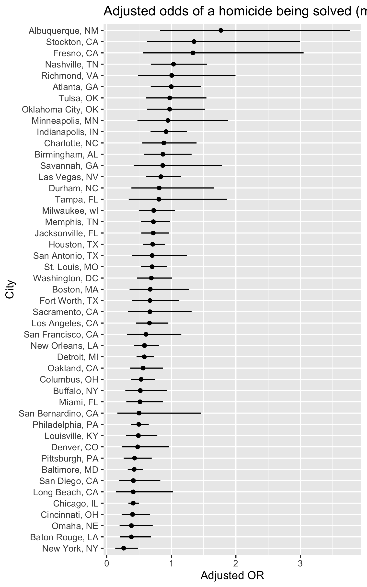
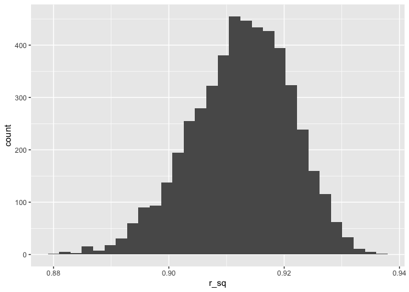
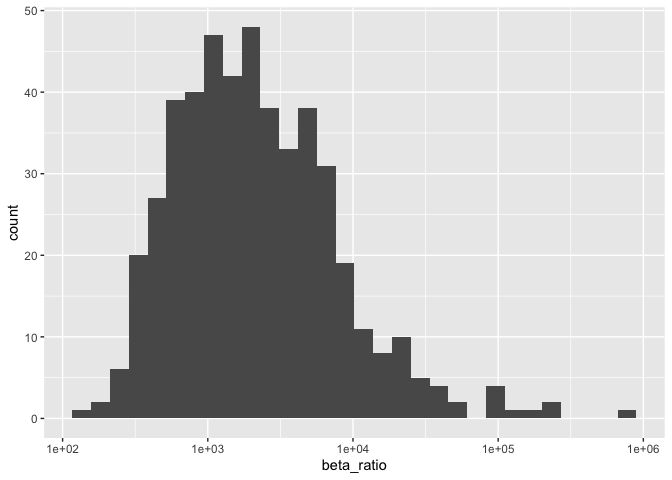

Homework 6
================
Yishi Wang

# Problem 1

## Data import and clean

Import data, create the city_state variable, and filter unwanted states:

``` r
homicides = read_csv("local_files/homicide-data.csv") |>
  mutate(
    city_state = str_c(city, state, sep = ", "),
    solved = if_else(disposition == "Closed by arrest", 1, 0),
    victim_age = na_if(victim_age, "Unknown"),
    victim_age = as.numeric(victim_age)
  ) |>
  filter(
    !city_state %in% c("Dallas, TX", "Phoenix, AZ", "Kansas City, MO", "Tulsa, AL"),
    victim_race %in% c("White", "Black"),
    !is.na(victim_age)
  )
```

    ## Rows: 52179 Columns: 12
    ## ── Column specification ────────────────────────────────────────────────────────
    ## Delimiter: ","
    ## chr (9): uid, victim_last, victim_first, victim_race, victim_age, victim_sex...
    ## dbl (3): reported_date, lat, lon
    ## 
    ## ℹ Use `spec()` to retrieve the full column specification for this data.
    ## ℹ Specify the column types or set `show_col_types = FALSE` to quiet this message.

## Baltimore model

First get the data for Baltimore:

``` r
baltimore =
  homicides |>
  filter(city_state == "Baltimore, MD")
```

Use glm function to fit a logistic regression model. Treating resolved
vs unresolved as the outcome and victim age, sex and race as predictors.

``` r
baltimore_fit = glm(solved ~ victim_age + victim_sex + victim_race,
      family = binomial, data = baltimore)

baltimore_or = baltimore_fit |>
  broom::tidy(conf.int = TRUE, exponentiate = TRUE)

baltimore_or
```

    ## # A tibble: 4 × 7
    ##   term             estimate std.error statistic  p.value conf.low conf.high
    ##   <chr>               <dbl>     <dbl>     <dbl>    <dbl>    <dbl>     <dbl>
    ## 1 (Intercept)         1.36    0.171        1.81 7.04e- 2    0.976     1.91 
    ## 2 victim_age          0.993   0.00332     -2.02 4.30e- 2    0.987     1.000
    ## 3 victim_sexMale      0.426   0.138       -6.18 6.26e-10    0.324     0.558
    ## 4 victim_raceWhite    2.32    0.175        4.82 1.45e- 6    1.65      3.28

Now if we look at the estimate and confidence interval of the adjusted
odds ratio for solving homicides comparing male to female alone:

``` r
baltimore_or |>
  filter(term == "victim_sexMale")
```

    ## # A tibble: 1 × 7
    ##   term           estimate std.error statistic  p.value conf.low conf.high
    ##   <chr>             <dbl>     <dbl>     <dbl>    <dbl>    <dbl>     <dbl>
    ## 1 victim_sexMale    0.426     0.138     -6.18 6.26e-10    0.324     0.558

We can see that the conf interval of the adjusted OR is (0.324, 0.558)
and the estimate OR is 0.426. We can say the odds that a homicide is
solved are about 0.574 lower for male victims than female victims in
Baltimore.

## All cities model

Similarly, we use glm function to fit a model for all cities and look at
the estimate and confidence interval of OR for solving homicides
comparing male to female alone:

``` r
city_or =
  homicides |>
  group_by(city_state) |>
  nest() |>
  mutate(
    fit = purrr::map(data, ~ glm(solved ~ victim_age + victim_sex + victim_race,
                                 family = binomial, data = .x)),
    results = purrr::map(fit, ~ broom::tidy(.x, conf.int = TRUE, exponentiate = TRUE))
  ) |>
  select(city_state, results) |>
  unnest(results) |>
  filter(term == "victim_sexMale")

city_or
```

    ## # A tibble: 47 × 8
    ## # Groups:   city_state [47]
    ##    city_state    term  estimate std.error statistic   p.value conf.low conf.high
    ##    <chr>         <chr>    <dbl>     <dbl>     <dbl>     <dbl>    <dbl>     <dbl>
    ##  1 Albuquerque,… vict…    1.77      0.385  1.48     1.39 e- 1    0.825     3.76 
    ##  2 Atlanta, GA   vict…    1.00      0.194  0.000397 1.000e+ 0    0.680     1.46 
    ##  3 Baltimore, MD vict…    0.426     0.138 -6.18     6.26 e-10    0.324     0.558
    ##  4 Baton Rouge,… vict…    0.381     0.306 -3.15     1.65 e- 3    0.204     0.684
    ##  5 Birmingham, … vict…    0.870     0.212 -0.657    5.11 e- 1    0.571     1.31 
    ##  6 Boston, MA    vict…    0.674     0.326 -1.21     2.26 e- 1    0.353     1.28 
    ##  7 Buffalo, NY   vict…    0.521     0.299 -2.18     2.90 e- 2    0.288     0.936
    ##  8 Charlotte, NC vict…    0.884     0.236 -0.524    6.00 e- 1    0.551     1.39 
    ##  9 Chicago, IL   vict…    0.410     0.102 -8.77     1.86 e-18    0.336     0.501
    ## 10 Cincinnati, … vict…    0.400     0.269 -3.41     6.49 e- 4    0.231     0.667
    ## # ℹ 37 more rows

## Plotting

Plot the OR and confidence interval for each city based our previous
result:

``` r
city_or_plot =
  city_or |>
  ggplot(aes(x = reorder(city_state, estimate), y = estimate)) +
  geom_point() +
  geom_errorbar(aes(ymin = conf.low, ymax = conf.high), width = 0) +
  coord_flip() +
  labs(
    x = "City",
    y = "Adjusted OR",
    title = "Adjusted odds of a homicide being solved (male vs female)"
  )

city_or_plot
```

<!-- -->

We can see that Albuquerque, NM has the highest adjusted OR and New
York, NY has the lowest adjusted OR, while a higher adjusted OR means
bigger chance a homicide is solved for male than female in that city.
Note that all cities except the top 5 have a OR \< 1, this means a
homicide is more likely to be solved for female victims than male
victims in most cities.

# Problem 2

## Data import

Import Central Park data from p8105.dataset:

``` r
data("weather_df")

weather_cp = 
  weather_df |>
  filter(name == "CentralPark_NY")
```

## Bootstraping

Create 5000 bootstrap samples and extract r^2 and (beta_tmin /
beta_prcp) based on provided formula

``` r
set.seed(1)

boot_results =
  weather_cp |>
  modelr::bootstrap(n = 5000) |>
  mutate(
    est = map(strap, ~ {
      dat = as_tibble(.x)
      fit = lm(tmax ~ tmin + prcp, data = dat)
      r_sq = broom::glance(fit)$r.squared
      coefs = broom::tidy(fit)
      beta_tmin = coefs |> filter(term == "tmin") |> pull(estimate)
      beta_prcp = coefs |> filter(term == "prcp") |> pull(estimate)

      tibble(
        r_sq = r_sq,
        beta_ratio = beta_tmin / beta_prcp
      )
    })
  ) |>
  unnest(est)
```

## Plotting Distributions

We first plot the distributions squared r:

``` r
boot_results |>
  ggplot(aes(x = r_sq)) +
  geom_histogram()
```

    ## `stat_bin()` using `bins = 30`. Pick better value `binwidth`.

<!-- -->

Most of our bootstrap samples have a squared r around 0.9, and this
implies a strong linear relationship. The model prediction should be
stable most of the times. Next, we plot the distributions of beta
ratios:

``` r
boot_results |>
  ggplot(aes(x = beta_ratio)) +
  geom_histogram()
```

    ## `stat_bin()` using `bins = 30`. Pick better value `binwidth`.

<!-- -->

We see that most beta ratios lie around 0, and implies that beta_2
(prcp) has a strong impact on tmax while beta_1 (tmin) has does not. The
precipitation is the main predictor of tmax.

## Identifying CI

First get the CI for squared r:

``` r
boot_results |>
  summarize(
    r_sq_low  = quantile(r_sq, 0.025),
    r_sq_high = quantile(r_sq, 0.975),
  )
```

    ## # A tibble: 1 × 2
    ##   r_sq_low r_sq_high
    ##      <dbl>     <dbl>
    ## 1    0.894     0.928

The 95% confidence interval for squared r is (0.894, 0.928). Similarly,
for beta ratios:

``` r
boot_results |>
  summarise(
    ratio_low  = quantile(beta_ratio, 0.025),
    ratio_high = quantile(beta_ratio, 0.975)
  )
```

    ## # A tibble: 1 × 2
    ##   ratio_low ratio_high
    ##       <dbl>      <dbl>
    ## 1    -5616.      4587.
